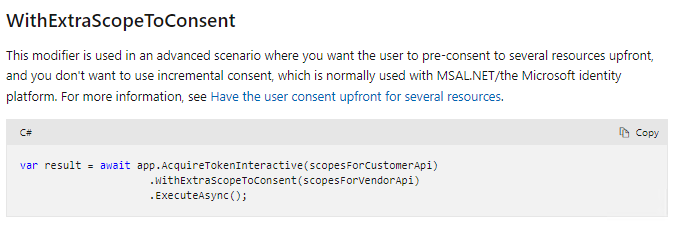
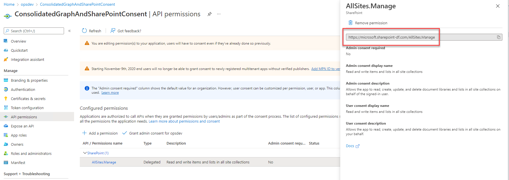
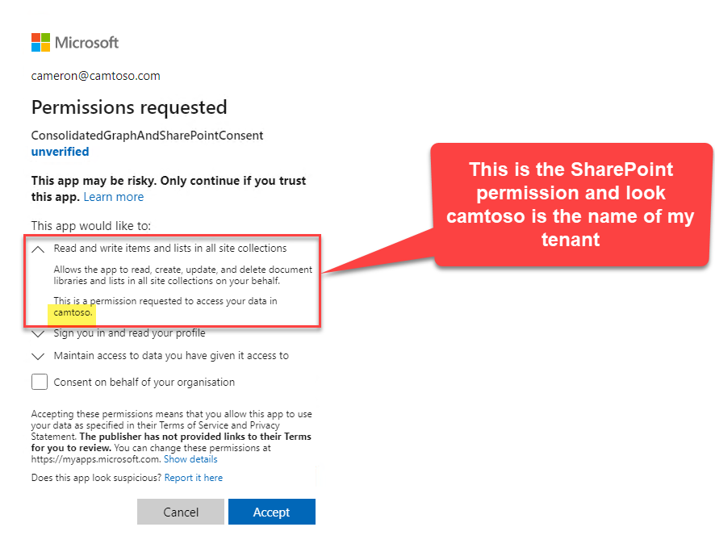

# MSAL Consolidated Graph and SharePoint Consent Proof of Concept

## Overview

This is a demo .Net Console app demonstrating a technique for presenting a single MSAL/Azure (V2) consent prompt that consolidates Microsoft Graph
and SharePoint user delegated resource scopes and then makes a simple call to the Graph API and the SharePoint REST API to prove the tokens work.

The reason for creating this simplified proof of concept was that I was struggling to find a documented/supported way to acheive
getting the end user to consent to both Graph and SharePoint permission scopes without being presented with 2 consent prompts. The reason I wanted this
is that I have an app that needs to make both Graph and SharePoint REST calls before it is of any use and it is a really bad experience for the user
to have to see a prompt for Graph permissions followed immediately by a second prompt for SharePoint permissions.

I have solved this problem in the past using the V1 auth model and declaring both the Graph and SharePoint pemrissions on the app registration and just
specifying the .default scope which is using MSAL but really just reverting back to the legacy V1 auth model. I wanted to solve this problem using the V2 
auth model approach of dynamically asking for scopes.

## Challenge 1 - MSAL AcquireTokenSilent & AcquireTokenInteractive only support one resource at a time

Let me walk you through what I've found from the documentation. When using MSAL and V2 permissions (where you specify your scopes in the calling code
rather than declaring all permissions on the app registration) the documented approach is to follow this pattern where you first try to AcquireTokenSilent
and if the user needs to login or grant consent to one or more of the requested scopes a MsalUiRequiredException is thrown, which you catch
and use AcquireTokenInteractive.

```
 try
        {
            authResult = await app.AcquireTokenSilent(scopes, firstAccount)
                .ExecuteAsync();
        }
        catch (MsalUiRequiredException ex)
        {
            // A MsalUiRequiredException happened on AcquireTokenSilent.
            // This indicates you need to call AcquireTokenInteractive to acquire a token
            System.Diagnostics.Debug.WriteLine($"MsalUiRequiredException: {ex.Message}");

            try
            {
                authResult = await app.AcquireTokenInteractive(scopes)
                    .WithAccount(accounts.FirstOrDefault())
                    .WithPrompt(Prompt.SelectAccount)
                    .ExecuteAsync();
            }
            catch (MsalException msalex)
            {
                ResultText.Text = $"Error Acquiring Token:{System.Environment.NewLine}{msalex}";
            }
        }
```

Above [sample code taken directly from the official Microsoft Docs](https://docs.microsoft.com/en-us/azure/active-directory/develop/tutorial-v2-windows-desktop?WT.mc_id=M365-MVP-5002900)

The problem here for my use case is that AcquireTokenSilent and AcquireTokenInteractive can only be used to get an access token from a single
resource (either the Graph or SharePoint) not both at the same time. If you try to make 2 calls you end up calling AcquireTokenInteractive (passing just the Graph resource scopes) which
the user gets prompted to consent to, and then the second call to AcquireTokenInteractive (passing just the SharePoint resource scopes) which the user gets a second prompt for. What I did find
that has been added to AcquireTokenInteractive however is that while you can only use it to retreive a token for a single resource you can optionally provide extra scopes for different
resources to ask the user to consent to. This has been [documented officially here](https://docs.microsoft.com/en-us/azure/active-directory/develop/scenario-desktop-acquire-token-interactive?tabs=dotnet?WT.mc_id=M365-MVP-5002900)
and below is a screenshot of the relevant section of that official documentation.



Brilliant this now gives us a way to initially try to acquire the Graph token but also in the same call ensure the user has consent to the SharePoint scopes.
Conceptually it should be as easy as this.

```
var result = await app.AcquireTokenInteractive(scopesForGraph)
                     .WithExtraScopeToConsent(scopesForSharePoint)
                     .ExecuteAsync();
```

## Challenge 2 - The SharePoint resource endpoint is tenant specific
Now we are down into the actual format of specifying the individual permission scopes. The Graph ones are pretty straight forward they all look like this 'https://graph.microsoft.com/user.read'
but what information I could find around the internet for specifying SharePoint permission scopes is the permissions are formatted like this 'https://YOUR-SHAREPOINT-TENANT/allsites.manage'. The permission scope itself
has your SharePoint tenant in it e.g. https://camtoso.sharepoint.com/allsites.manage. Now this may not be an issue if you know the SharePoint tenant, but in my case I'm building
a multi-tenant application and I can't possibily know who my users are going to be and what tenant they will come from. 

So here's the dilemma:
- I can't prompt the user for consent to SharePoint until I know their SharePoint tenant URL
- The way to get their SharePoint tenant URL is to call the Graph
- I can't call the Graph until I prompt for consent

It seems we are back to the original crappy user experience that we need to prompt for consent (just for Graph permissions) so we can call the Graph to get the SharePoint tenant URL so we can
then prompt again to get consent for the SharePoint permissions before we can call the SharePoint REST API.

## The Solution
Ok lot of background info, but it's all getting us closer to the code in this repo and the challenges it solves. Next I turned my attention to the old v1 auth model of specifying the mixed
permissions (Graph and SharePoint) on the app registration and then just getting the user to consent to that. Note - the idea of this is still very relevant as this is how a tenant admin 
gives consent on behalf of all users. The admin consent URL just points to an app registration by its id and the admin is presented with the consolidated list of permission to grant consent to.
So under that model how does the app reg know what the SharePoint scope should be for a multi-tenant app? I took a closer look at an app reg in Azure portal. This is what it looks like.



Ok so that's intriguing, what is this https://microsoft.sharepoint-df.com, it's not the name of my tenant that I've created the app reg in. My best guess is that it stands for dogfood and it's the Microsoft SharePoint dogfood tenant.
Alright so maybe there's something magical about this tenant, let's put it to the test. Rather than worry about trying to figure out the actual SharePoint tenant for our user let's change the first
consent prompt we show (for the Graph) and pass in this weird Microsoft tenant in the .WithExtraScopeToConsent. So now we are conceptually going to do this:

```
var result = await app.AcquireTokenInteractive("https://graph.microsoft.com/user.read")
                     .WithExtraScopeToConsent("https://microsoft.sharepoint-df.com/allsites.manage")
                     .ExecuteAsync();
```

Get outta town, you know what this did? It gave me the consolidated prompt, but have a look at those SharePoint permissions, it knows who the user is, and it's dynamically switched
out that Microsoft SharePoint tenant for the users tenant without us doing anything!



Alright we've got some crazy undocumented magic going on here, but this does appear to give us the solution to the problem from a consent perspective. I went on to discover that we do still need to
do the work of finding the users real SharePoint tenant URL because we need to use the real tenant URL in the scope when we try to acquire the SharePoint access token. Remember in that dialog above we were trying
to acquire just the Graph token but passing in the extra SharePoint scope just for consent.

With all that background and comments in the code I think you'll find your way through the proof of concept pretty easily. I intentionally kept the code as simplistic as I could (no Graph SDK, no SharePoint SDK, no error handling) just raw
calls so you can see the mechanics without extra code fluff.

## How to run the code
I've left my clientId in the code (which points to the multi-tenant app registration in my tenant), feel free to use that and all you've got to do is pull down this repo into Visual Studio and press F5 to start debugging.

If you would rather create an app reg in your own tenant and use it instead, then I suggest using the [Azure CLI](https://docs.microsoft.com/en-us/cli/azure/what-is-azure-cli?WT.mc_id=M365-MVP-5002900). This command will create the app reg in your tenant. Grab the resulting application id (clientid) and replace it in the code.

```
az ad app create --display-name ConsolidatedGraphAndSharePointConsent --native-app true --reply-urls http://localhost --available-to-other-tenants true
```

It's a .Net Core Console application and as soon as it starts up it will try to get the Graph token. MSAL will pop open a browser window to get you to authenticate (using a Microsoft work/school account) and since you haven't consented,
after you login  you will see the consent dialog asking for both Graph and SharePoint permissions.
Once you consent, a call is made to the Graph API to retrieve the actual SharePoint tenant URL which gets output to the console window.
That SharePoint tenant URL is then used in the scope to acquire a SharePoint access token and then a call to the SharePoint REST API is made and an extract of that response is output to the console to prove the solution end to end works
and we are making successful calls to both Graph API and SharePoint REST API.


